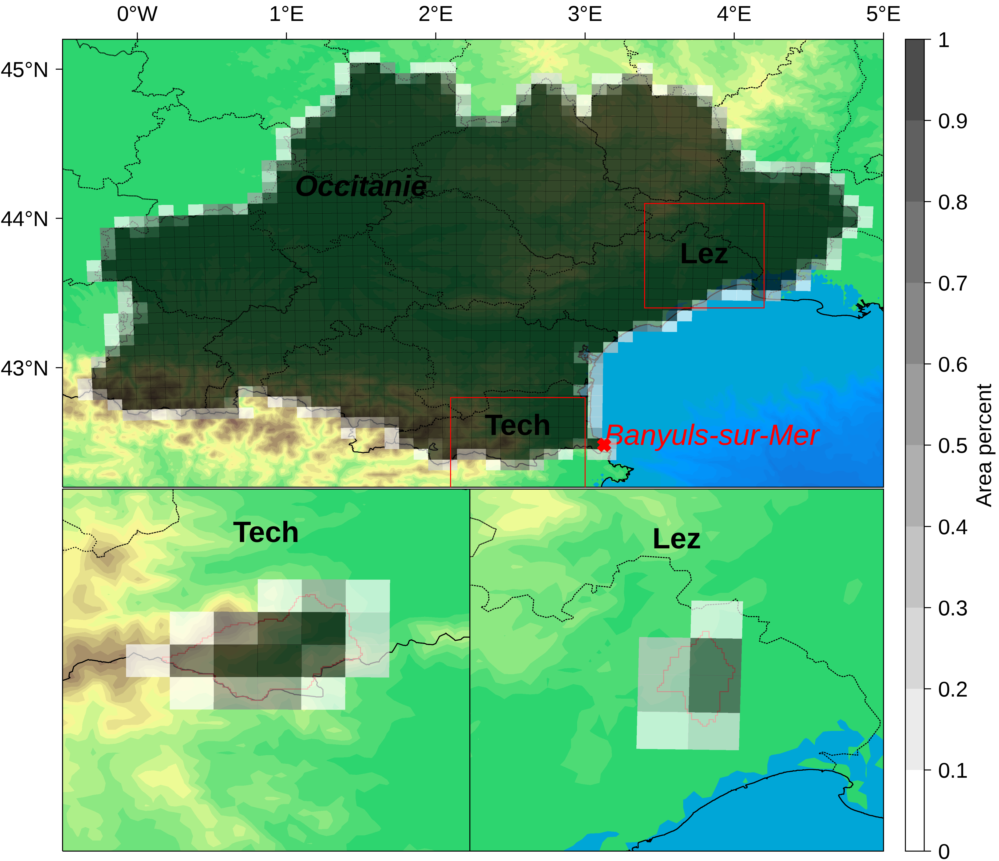
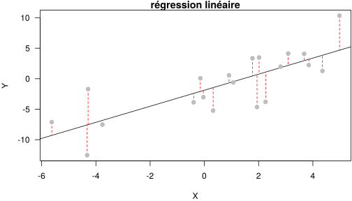
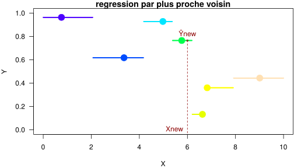
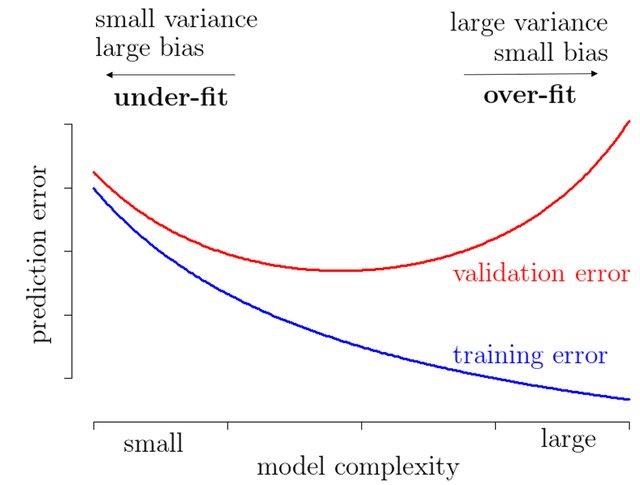
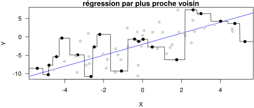

# TP correction de biais

## Introduction

Le but de ce TP est d'illustrer le principe des méthodes de type
"perfect prognosis". Nous nous focaliserons sur deux méthodes classique
de "perfect prognosis" que sont la régression linéaire et la régression
par plus proche voisin (i.e. par analogues). Nous les utiliserons dans
un contexte de descente d'échelle où le but est de prédire les valeurs
de variables climatiques à l'échelle du bassin du Tech (ou du Lez) à
partir des valeurs des mêmes variables climatiques cette fois-ci
moyennées à l'échelle de la région Occitanie. Dans un premier temps, la
relation entre large et petite échelle sera apprise sur les réanalyses
SAFRAN. Dans un second temps, nous verrons si cette relation peut être
appliquée pour faire de la descente d'échelle avec les simulations des
modèles suivants :

| gcm               | rcm           | run    | scenario   |
|:------------------|:--------------|:-------|:-----------|
| IPSL-IPSL-CM5A-MR | IPSL-WRF381P  | r1i1p1 | historical |
|                   |               |        | rcp45      |
|                   |               |        | rcp85      |
| MOHC-HadGEM2-ES   | ICTP-RegCM4-6 | r1i1p1 | historical |
|                   |               |        | rcp85      |

La figure ci-dessous illustre les points de grilles SAFRAN utilisés pour
construire respectivement les séries temporelles moyennées sur la région
Occitanie, le bassin du Tech et le bassin du Lez :



Les cases et la colorbar associées représentent la portion de chaque
point de grille interceptant la région Ocitanie, les bassins Tech et
Lez, les séries des modèles et des observations SAFRAN ont été calculés
avec une moyenne pondéré par ces valeurs.

## Rappels préliminaires

### Notations

Pour la variable climatique $j, j \in \{1,\ldots,p\}$, les données
moyennées à l'échelle de la région Occitanie sont dénotées par :
$$ \mathbf{x_j} = (x_{1,j}, \ldots, x_{n, j})' \in \mathbb{R}^n$$

et les données moyennées à l'échelle du bassin pour cette même variable
sont dénotées par :
$$ \mathbf{y_j} = (y_{1,j}, \ldots, y_{n, j})' \in \mathbb{R}^n$$

où $n$ est le nombre de pas de temps

On suppose que les données $x_{i,j}$ et $y_{i,j}$ sont respectivement
des réalisations des variables aléatoires $X_j$ et $Y_j$, pour
$i \in \{1,\ldots,n\}$ et $j \in \{1,\ldots,p\}$.

### Perfect prognosis et régression

Dans les méthodes de perfect prognosis, pour faire de la descente
d'échelle statistique pour la variable climatique $X_j$, on cherche à
trouver une fonction, $f$, qui transforme les réalisations des variables
climatiques de grande échelle $(x_{i,1}, \ldots, x_{i,p})$ en
réalisations $y_{i,j}$ de la variable à fine échelle $Y_j$, pour
$i \in \{1,\ldots,n\}$. Les variables de grandes échelle
$X_j, j \in \{1,\ldots, p\}$ sont appellées des *prédicteurs* et la
variable à prédire $Y_j$ est le *prédictant*. .

On suppose que la transformation n'est pas parfaite et qu'il reste en
générale une erreur résiduelle $\epsilon$. Le modèle statistique est
alors le suivant:
$$ y_{i,j} = f(x_{i,1}, \ldots, x_{i,p}) + \epsilon_i $$ pour
$i \in \{1,\ldots,n\}$. Les erreurs, $\epsilon_i, i \in \{1,\ldots,n\}$,
sont supposés aléatoires, de moyenne nulle, et en générale indépendantes
et identiquement distibuées.

Avec ce modèle, on note alors que :
$$  f(x_{i,1}, \ldots, x_{i,p}) = \mathbb{E}[Y_j | X_1 = x_{i, 1}, \ldots, X_p = x_{i, p}] $$

*Remarque importante*: Dans ce modèle de régression, on suppose que les
réalisations des variables $X_j$ et $Y_j$ sont appareillées. Ainsi, les
méthodes de types perfect prognosis ne pas peuvent être employé (en tous
cas pas directement) pour faire la descente d'échelle entre une série
temporelle à large échelle provenant d'un modèle climatique et une série
temporelle à fine échelle issue d'observations, les deux séries n'ayant
pas la même temporalité.

Il existe plusieurs façons pour tenter d'approcher et d'estimer $f$.
Nous pouvons avoir recours à des méthodes de régression dites
paramétriques et non-paramétriques.

Dans les méthodes paramétriques, nous supposons connaitre la forme
générale de la fonction $f$. Dans ce cas, le nombre de paramètres à
estimer est fixe et ne dépend pas du nombre d'individus.

La **régression linéaire** suppose par exemple une relation linéaire
entre les prédicteurs et le prédictant:
$$f(x_{i,1}, \ldots, x_{i,p}) = b_0 + b_1 x_{i,1} + \ldots + b_p x_{i,p}$$
où les paramètres $b_j, j \in \{0, \ldots, p\}$ sont à estimer à partir
des données, par exemple par moindres carrés.

Pour un nouveaux p-uplet de prédicteurs de grande échelle,
$(x_{*,1}, \ldots, x_{*,p})$, la prediction à fine échelle est données
par:
$$\hat{y}_{*,j} = \hat{b_0} + \hat{b_1} x_{*,1} + \ldots + \hat{b_p} x_{*,p}$$
où $\hat{b_j}, j \in \{0, \ldots, p\}$ sont les paramètres estimés.

*Exemple synthétique de régression linéaire avec 1 prédicteurs :*



Dans les méthodes non-paramétriques, nous ne faisons pas d'hypothèses
sur la forme de la fonction $f$, elle est déterminée par les données.
Contrairement à ce que l'on peux penser, les régressions
non-paramétriques possèdent (implicitement) des paramètres dont le
nombre augmente avec le nombre d'individus.

La **régression par plus proche voisin** (k-nearest-neighbours avec
$k = 1$) est une méthode de régression non-paramétrique où un pour
p-uplet de prédicteurs de grande échelle, $(x_{*,1}, \ldots, x_{*,p})$,
la prédiction à fine échelle est données par:
$$f(x_{*,1}, \ldots, x_{*,p}) = y_{i^*, j}$$ avec
$$i^* = \underset{i}{\arg\min} \quad d\{(x_{i,1}, \ldots, x_{i,p}), (x_{*,1}, \ldots, x_{*,p})\}$$
où $d$ est une distance, par exemple la distance euclidienne.

Moins formellement, la prédiction par la méthode du plus proche voisin
(du plus proche analogue) revient à prendre dans un catalogue de
situations météorologiques observées dans le passé, la valeur de la
variable à fine échelle correspondant à la situation de grande échelle
la plus proche de celle pour laquelle nous voulons faire une prédiction.
Ce catalogue de situations météorologiques est aussi appelé parfois
"base d'apprentissage" ou "période de calibration".

*Exemple synthétique de régression par plus proche voisin avec 1
prédicteurs :*



### Évaluation des modèles statistiques pour la prédiction.

Il faut bien faire la différence entre :

-   la qualité de l'ajustement, i.e. la capacité du modèle à pouvoir
    "coller" aux données qui ont servi à calibrer le modèle,
-   la capacité de généralisation, i.e. la capacité de notre modèle à
    faire de bonnes prédictions même sur des situations qui ne sont pas
    présente dans la base d'apprentissage.

Plus un modèle est complexe (i.e. plus il a de paramètres) plus il sera
capable de s'ajuster aux données; mais cela ne garantie pas sa capacité
de généralisation.



*source : [Arthur
Charpentier](https://hal.archives-ouvertes.fr/hal-01568851v1)*

*Exemple synthétique de sur-apprentissage*



C'est pourquoi, lorsque c'est possible, on divise toujours nos données
en deux parties indépendantes: une qui sert à ajuster nos modèles,
l'autre à évaluer leurs performances de prédiction.

------------------------------------------------------------------------

## Quelques réglages

### Chemin vers les données

Le chemin d'accès vers les données d'entrée sera contenu dans la
variable `ipath`, à modifier en fonction de l'endroit où vous avez mis
les données sur votre ordinateur. Normalement le repertoire `ipath` doit
contenir les répertoires `CORDEX` et `SAFRAN`.

Notez que la fonction `file.path` permet de joindre des chemins sans se
soucier si le séparateur est un `/` (UNIX-like) ou un `\` (windows).

```{r}
ipath = file.path(".", "data")
```

### Fonctions d'extraction des données

Ici sont réunis les fonctions pour extraire les données:

-   `SI2human_units`: cette fonction transforme les unités. (K -\> °C,
    kg/m2/s -\> mm / jour),
-   `read_observations`: cette fonction permet de relire les données
    SAFRAN,
-   `read_models`: cette fonction permet de relire les données des
    modèles,
-   `extract_period`: cette fonction permet de sélectionner une saison
    et une sous période de temps.

```{r}
SI2human_units = function(X)
{
	for( v in list("tas","tasmin","tasmax") )
		X[,v] = X[,v] - 273.15
	
	X[,"prtot"] = 86400 * X[,"prtot"]
	
	return(X)
}
```

```{r}
## zone: 'Lez' ou 'Tech'
## ipath: chemin d'accès
read_observations = function( zone , ipath )
{
    dir = "SAFRAN"
    ifile = paste0(dir,"_",zone,".csv")
    if (zone == "Occitanie") {
        dir = "Occitanie"
        ifile = paste0("SAFRAN_",zone,"_weight.csv")

    }
    Y     = read.csv( file.path( ipath , dir , ifile ) , header = TRUE , row.names = 1 )

	return( SI2human_units(Y) )
}
```

```{r}
## gcm: identifiant gcm (voir le tableau de l'introduction)
## rcm: identifiant rcm (voir le tableau de l'introduction)
## run: identifiant du run (voir le tableau de l'introduction)
## scenario: le scénario
## zone: 'Lez' ou 'Tech'
## ipath: chemin d'accès
read_models = function( gcm , rcm , run , scenario , zone , ipath )
{

	ifileh = paste0( paste( gcm , rcm , run , "historical" , zone , sep = "_" ) , ".csv" )
	ifilef = paste0( paste( gcm , rcm , run , scenario     , zone , sep = "_" ) , ".csv" )
	dir = "CORDEX"
    if (zone == "Occitanie") dir = "Occitanie"
	Xh = read.csv( file.path( ipath , dir , ifileh ) , header = TRUE , row.names = 1 )
	Xf = read.csv( file.path( ipath , dir , ifilef ) , header = TRUE , row.names = 1 )
	
	X  = rbind(Xh,Xf)
	
	return(SI2human_units(X))
}
```

```{r}
## data: données d'entrée
## seas: la saison choisie, 'JJA', 'DJF', 'MAM' ou 'SON'
## period: un vecteur de deux années
extract_period = function( data , seas , period )
{
	## Build period
	t0 = base::paste( as.integer(period[1]) - 1 , "11" , "30" , sep = "-" )
	t1 = base::paste( as.integer(period[2])     , "12" , "01" , sep = "-" )
	
	## Transform seas to numbers
	mseas = list(
			"MAM" = base::c("03","04","05"),
			"JJA" = base::c("06","07","08"),
			"SON" = base::c("09","10","11"),
			"DJF" = base::c("12","01","02")
			)
	
	## Extract period
	odata = subset( data  , (t0 < row.names(data)) & (row.names(data) < t1) & (format.Date( row.names(data) , "%m" ) %in% mseas[[seas]]) )
	
	return(odata)
}
```

------------------------------------------------------------------------

## I. Exploration des données

Nous proposons de faire une première fois ce TP sur la zone *Tech*, en
se restreignant aux étés. Nous prendrons comme période calibration 1976
/ 2005, et comme période de validation 2006 / 2020. Initialisons donc
les variables correspondantes:

```{r}
zone  = "Tech"
seas  = "JJA"
calib = c(1976,2005)
valid = c(2006,2020)
```

Dans la deuxième partie du TP, nous travaillerons aussi avec le modèle
*IPSL-IPSL-CM5A-MR / IPSL-WRF381*, scénario *rcp85*:

```{r}
gcm      = "IPSL-IPSL-CM5A-MR"
rcm      = "IPSL-WRF381P"
run      = "r1i1p1"
scenario = "rcp85"
```

### I.1. Les observations

Chargement des des données SAFRAN à grande échelle (variable `X`) et à
fine échelle (variable `Y`) à l'aide de la fonction `read_observations`.
On utilise la fonction `extract_period` pour séparer les données en base
de calibration et base de validation.

```{r}
Y = read_observations( zone , ipath )
X = read_observations( "Occitanie" , ipath )
```

```{r}
Yc = extract_period( Y , seas , calib )
Yv = extract_period( Y , seas , valid )
Xc = extract_period( X , seas , calib )
Xv = extract_period( X , seas , valid )
```

### I.3. Format des données

Les données `Yc`, `Yv`, `Xc` et `Xv` sont des `data.frame` où les lignes
sont l'axe du temps, et les colonnes les variables. Vous pouvez ainsi
accéder directement à une ligne / colonne particulière avec la syntaxe
suivante:

-   `Yc[,"tas"]`: Affiche la colonne contenant la température moyenne.
-   `Yc["1976-01-01",]`: Affiche toutes les variables le 1er janvier
    1976. 

**Astuce** Vous pouvez afficher les noms des lignes et colonnes avec les
fonctions `colnames` et `rownames`.

### I.4. Quels différences entre les variables à grande et fine échelle ?

**Q1.** Comparer, sur la période de calibration, les observations
grandes et fines échelles à l'aide d'un scatterplot (fonction `plot`) et
calculer l'erreur quadratique moyenne (MSE: Mean Square Error) ainsi que
la corrélation.

```{r, fig.height = 8, fig.width = 12}

xylim <- as.data.frame(apply(rbind(Xc, Xv, Yc, Yv), 2, range))

mse_cal <- apply((Yc - Xc)^2, 2, mean)

cat("--- mse --- \n")
mse_cal

corr_cal <- mapply(cor, x = Xc, y = Yc)

cat("--- corr --- \n")
corr_cal

par(mfrow = c(2, 3))
invisible(mapply(
        function(x, y, main, xlab, ylab, xlim, ylim){
        plot(x = x, y = y, main = main, xlab = xlab, ylab = ylab, xlim = xlim, ylim = ylim)
        abline(b = 1, a = 0, col = "red")
        },
    x = Xc, y = Yc, main = names(Xc), xlab = "Xc", ylab = "Yc", xlim = xylim, ylim = xylim
))
```

**Q2.** Faire de même sur la période de validation. Y'a-t-il une
différence ?

```{r, fig.height = 8, fig.width = 12}

mse_val <- apply((Yv - Xv)^2, 2, mean)

cat("--- mse --- \n")
mse_val

corr_cal <- mapply(cor, x = Xc, y = Yc)

cat("--- corr --- \n")
corr_cal


par(mfrow = c(2, 3))
invisible(mapply(
    function(x, y, main, xlab, ylab, xlim, ylim){
        plot(x = x, y = y, main = main, xlab = xlab, ylab = ylab, xlim = xlim, ylim = ylim)
        abline(b = 1, a = 0, col = "red")
        },
    x = Xc, y = Yc, main = names(Xc), xlab = "Xc", ylab = "Yc", xlim = xylim, ylim = xylim
))
```

**Q3.** Comparer, sur la période de calibration, les distributions des
observations grandes et fines échelles à l'aide d'un graphique
quantile-quantile (fonction `qqplot`).

```{r, fig.height = 8, fig.width = 12}
par(mfrow = c(2, 3))
invisible(mapply(
    function(x, y, main, xlab, ylab, xlim, ylim){
        qqplot(x = x, y = y, main = main, xlab = xlab, ylab = ylab, xlim = xlim, ylim = ylim)
        abline(b = 1, a = 0, col = "red")
        },
    x = Xc, y = Yc, main = names(Xc), xlab = "Xc", ylab = "Yc", xlim = xylim, ylim = xylim
))
```

**Q4.** Faire de même sur la période de validation. Y'a-t-il une
différence ?

```{r, fig.height = 8, fig.width = 12}
options(repr.plot.width =12, repr.plot.height = 8)
par(mfrow = c(2, 3))
invisible(mapply(
    function(x, y, main, xlab, ylab, xlim, ylim){
        qqplot(x = x, y = y, main = main, xlab = xlab, ylab = ylab, xlim = xlim, ylim = ylim)
        abline(b = 1, a = 0, col = "red")
        },
    x = Xv, y = Yv, main = names(Xc), xlab = "Xv", ylab = "Yv", xlim = xylim, ylim = xylim
))
```

------------------------------------------------------------------------

## II Downscaling sur observations

## II.1 Régression Linéaire

**Q5.** Utiliser la fonction `lm` pour construire un modèle de descente
d'échelle pour la variable `tas`. Le modèle prendra comme prédicteurs
les 6 variables climatiques à grande échelle. Vous pouvez accéder à
l'aide de la fonction `lm` en tapant `?lm`. Afficher le modèle ajusté
avec la fonction `summary`.

***Tips*** La fonction `lm` permet de décrire un modèle linéaire de
manière simple à l'aide des *formula*. Par exemple, le modèle de
régression linéaire suivant:
$$ \mathbf{y} = a_0 \mathbf{x}_0 + a_1 \mathbf{x}_1$$ où $\mathbf{y}$
est le prédicant, et $\mathbf{x}_0$ et $\mathbf{x}_1$ les prédicteurs,
peut être décrit de la manière suivante:
`lm(y ~ x0 + x1 , data = data.frame( y = mydata_y , x0 = mydata_x0 , x1 = mydata_x1) )`

```{r}
varname <- "tas"
predictant <- Yc$tas
lm_tas <- lm(predictant ~ ., data = Xc)
summary(lm_tas)
```

**Q6.** Evaluer à l'aide d'un scatterplot, de la corrélation et de la du
MSE, la qualité d'ajustement du modèle sur la période de calibration. Y
a-t-il une amélioration par rapport à `tas` moyennée à grande échelle ?
Utiliser la fonction `predict` pour obtenir les prédictions à fine
échelle.

```{r, fig.height = 5, fig.width = 5}
tas_hat_cal <- predict(lm_tas)

sprintf("mse_cal = %f", mean((Yc$tas - tas_hat_cal)^2))
sprintf("corr_cal =  %f", cor(Yc$tas, tas_hat_cal))

options(repr.plot.width = 4, repr.plot.height = 4)
xylim <- range(c(Yc$tas, tas_hat_cal))
plot(Yc$tas, tas_hat_cal)
abline(b = 1, a = 0, col = "red")
```

**Q7.** De même, évaluer la capacité de généralisation du modèle sur la
période de validation. Les résultats sont-il similaires à ceux obtenus
sur la période de calibration ?

```{r, fig.height = 5, fig.width = 5}
tas_hat_val <- predict(lm_tas, newdata = Xv)

sprintf("mse_val = %f", mean((Yv$tas - tas_hat_val)^2))
sprintf("corr_val =  %f", cor(Yv$tas, tas_hat_val))

options(repr.plot.width = 4, repr.plot.height = 4)
xylim <- range( Yv$tas, tas_hat_val)
plot(Yv$tas, tas_hat_val)
abline(b = 1, a = 0, col = "red")
```

**Q8.** Créer, ajuster et évaluer un modèle de régression linéaire pour
faire de la descente d'échelle pour la variable `prtot`. Que pensez-vous
des résultats ?

```{r, fig.height = 5, fig.width = 8}
predictant <- Yc$prtot
lm_prtot <- lm(predictant ~ ., data = Xc)
summary(lm_prtot)

prtot_hat_cal <- predict(lm_prtot)
prtot_hat_val <- predict(lm_prtot, newdata = Xv)

data.frame(
    period = c("calibration", "validation"),
    mse = c(mean((Yc$prtot - prtot_hat_cal)^2), mean((Yv$prtot - prtot_hat_val)^2)),
    corr = c(cor(Yc$prtot, prtot_hat_cal), cor(Yv$prtot, prtot_hat_val))
)

xylim <- range(Yc$prtot, prtot_hat_cal, Yv$prtot, prtot_hat_val)
options(repr.plot.width = 8, repr.plot.height = 4)
par(mfrow = c(1, 2))
plot(Yc$prtot, prtot_hat_cal, main = "calibration", xlim = xylim, ylim = xylim)
abline(b = 1, a = 0, col = "red")
plot(Yv$prtot, prtot_hat_val, main = "validation",  xlim = xylim, ylim = xylim)
abline(b = 1, a = 0, col = "red")
```

**Question bonus:** Essayer de trouver la meilleurs combinaisons de
prédicteurs qui donne les meilleurs résultats sur la période de
validation pour la prédiction de `tas` ou de `pr`. Vous pouvez par
exemple utiliser la fonction `step`.

```{r, fig.height = 5, fig.width = 8}
lm_step_prtot <- step(lm_prtot)

prtot_hat_step_cal <- predict(lm_step_prtot)
prtot_hat_step_val <- predict(lm_step_prtot, newdata = Xv)

data.frame(
    period = c("calibration", "validation"),
    mse = c(mean((Yc$prtot - prtot_hat_step_cal)^2), mean((Yv$prtot - prtot_hat_step_val)^2)),
    corr = c(cor(Yc$prtot, prtot_hat_step_cal), cor(Yv$prtot, prtot_hat_step_val))
)

xylim <- range(Yc$prtot, prtot_hat_step_cal, Yv$prtot, prtot_hat_step_val)
options(repr.plot.width = 8, repr.plot.height = 4)
par(mfrow = c(1, 2))
plot(Yc$prtot, prtot_hat_step_cal, main = "calibration", xlim = xylim, ylim = xylim)
abline(b = 1, a = 0, col = "red")
plot(Yv$prtot, prtot_hat_step_val, main = "validation",  xlim = xylim, ylim = xylim)
abline(b = 1, a = 0, col = "red")
```

## II.2. Régression par plus proche voisin

**Q9.** Utiliser la régression par plus proche voisin pour la faire de
descente d'échelle pour la variable `tas` sur la période de calibration.
Le modèle prendra comme prédicteurs les 6 variables climatiques à grande
échelle. Vous pouvez par exemple utiliser la distance euclidienne pour
trouver le plus proche voisin. Evaluer la capacité d'ajustement de la
régression par plus proche voisin.

**astuce :** vous pouvez, si vous le souhaitez, utiliser les fonctions
`nndist` et `nn` définies ci-dessous.

```{r, fig.height = 5, fig.width = 5}
# Calcul des distances d'une situation (tuple) aux situations présentes dans le catalogue (calset)
nndist <- function(tuple, calset) {  
    diff <- sweep(calset, MARGIN = 2, STATS = as.numeric(tuple), FUN="-", check.margin=T)
    sqrt(apply(diff^2, 1, sum))
}

# Pour chaque lignes de la matrice tuples, 
# retourne l'indice de ligne correspondant à l'analogue le plus proche dans le catalogue.
nn <- function(tuples, calset) {
    apply(tuples, 1, function(tuple) which.min(nndist(tuple, calset)))
}

# Prédictions
Yc_hat <- Yc[nn(Xc, Xc),]
          
sprintf("mse_cal = %f", mean((Yc_hat[ ,"tas"] - Yc[, "tas"])^2))
sprintf("corr_cal =  %f", cor(Yc_hat[ ,"tas"], Yc[, "tas"]))          

xylim <- range(Yc_hat[ ,"tas"], Yc[, "tas"])
options(repr.plot.width = 4, repr.plot.height = 4)
plot(Yc_hat[ ,"tas"], Yc[, "tas"], main = "calibration", xlim = xylim, ylim = xylim)
abline(b = 1, a = 0, col = "red")
```

**Q10.** Appliquer la régression par plus proche voisin pour faire la
descente d'échelle pour la variable `tas` sur validation en utilisant
les données de la période de calibration comme catalogue de situations
météorologiques. Evaluer la capacité de généralisation de la régression
par plus proche voisin. Les résultats sont-il similaires à ceux obtenus
sur la période de calibration ?

```{r, fig.height = 5, fig.width = 5}
Yv_hat <- Yc[nn(Xv, Xc),]

sprintf("mse_val = %f", mean((Yv_hat$tas - Yv$tas)^2))
sprintf("corr_val =  %f", cor(Yv_hat$tas, Yv$tas))     

xylim <- range(Yv_hat$tas, Yv$tas)
options(repr.plot.width = 4, repr.plot.height = 4)
plot(Yv_hat$tas, Yv$tas, main = "validation", xlim = xylim, ylim = xylim)
abline(b = 1, a = 0, col = "red")
```

**Q11.** Créer, ajuster et évaluer un modèle de régression par plus
proche voisin pour faire de la descente d'échelle pour la variable
`prtot`. Que pensez-vous des résultats ?

```{r, fig.height = 5, fig.width = 8}
varname = "prtot"

data.frame(
    period = c("calibration", "validation"),
    mse = c(mean((Yc_hat[ ,varname] - Yc[, varname])^2), mean((Yv_hat[ ,varname] - Yv[, varname])^2)),
    corr = c(cor(Yc_hat[ ,varname], Yc[, varname]), cor(Yv_hat[ ,varname], Yv[, varname]))
)

xylim <- range(Yc_hat[ ,varname], Yc[, varname], Yv_hat[ ,varname], Yv[, varname])
options(repr.plot.width = 8, repr.plot.height = 4)
par(mfrow = c(1, 2))
plot(Yc_hat[ ,varname], Yc[, varname], main = "calibration", xlim = xylim, ylim = xylim)
abline(b = 1, a = 0, col = "red")
plot(Yv_hat[ ,varname], Yv[, varname], main = "validation",  xlim = xylim, ylim = xylim)
abline(b = 1, a = 0, col = "red")
```

**Question bonus:** Cela fait-il une différence si on normalise au
préalable les prédicteurs ? vous pouvez utiliser la fonction `scale`.

```{r, fig.height = 5, fig.width = 8}
# Exemple

Ycs_hat <- Yc[nn(scale(Xc), scale(Xc)),]
Yvs_hat <- Yc[nn(scale(Xv), scale(Xc)),]
   
varname = "prtot"

data.frame(
    period = c("calibration", "validation"),
    mse = c(mean((Ycs_hat[ ,varname] - Yc[, varname])^2), mean((Yvs_hat[ ,varname] - Yv[, varname])^2)),
    corr = c(cor(Ycs_hat[ ,varname], Yc[, varname]), cor(Yvs_hat[ ,varname], Yv[, varname]))
)

xylim <- range(Ycs_hat[ ,varname], Yc[, varname], Yvs_hat[ ,varname], Yv[, varname])
options(repr.plot.width = 8, repr.plot.height = 4)
par(mfrow = c(1, 2))
plot(Ycs_hat[ , varname], Yc[, varname], main = "calibration", xlim = xylim, ylim = xylim)
abline(b = 1, a = 0, col = "red")
plot(Yvs_hat[ , varname], Yv[, varname], main = "validation",  xlim = xylim, ylim = xylim)
abline(b = 1, a = 0, col = "red")
```

**Question bonus:** Essayer de trouver la meilleurs combinaisons de
prédicteurs qui donne les meilleurs résultats sur la période de
validation pour la prédiction de `tas` ou de `pr`.

```{r, fig.height = 5, fig.width = 8}
# Exemple: 
varsubset <- c("tas", "tasmin", "sfcWind", "prtot")
Xc_subset <- Xc[, varsubset]
Xv_subset <- Xv[, varsubset]

Ycs_hat <- Yc[nn(scale(Xc_subset), scale(Xc_subset)),]
Yvs_hat <- Yc[nn(scale(Xv_subset), scale(Xc_subset)),]
   
varname = "prtot"

data.frame(
    period = c("calibration", "validation"),
    mse = c(mean((Ycs_hat[ ,varname] - Yc[, varname])^2), mean((Yvs_hat[ ,varname] - Yv[, varname])^2)),
    corr = c(cor(Ycs_hat[ ,varname], Yc[, varname]), cor(Yvs_hat[ ,varname], Yv[, varname]))
)

xylim <- range(Ycs_hat[ ,varname], Yc[, varname], Yvs_hat[ ,varname], Yv[, varname])
options(repr.plot.width = 8, repr.plot.height = 4)
par(mfrow = c(1, 2))
plot(Ycs_hat[ , varname], Yc[, varname], main = "calibration", xlim = xylim, ylim = xylim)
abline(b = 1, a = 0, col = "red")
plot(Yvs_hat[ , varname], Yv[, varname], main = "validation",  xlim = xylim, ylim = xylim)
abline(b = 1, a = 0, col = "red")
```

**Question bonus**: Quel est votre meilleur modèle ? Quelles pistes
d'amélioration ?

## III. Appliquer les modèles de descente échelle aux modèles de climat.

### III.1. Chargement des données de grande échelle du modèle de climat

```{r}
X_rcm = read_models( gcm , rcm , run , scenario , 'Occitanie' , ipath )
```

```{r}
Xc_rcm = extract_period( X_rcm , seas , calib )
Xv_rcm = extract_period( X_rcm , seas , valid )
```

#### III.2. Appliquer le modèle linéaire

**Q12.** Appliquer, pour la variable `tas`, la relation entre grande
échelle et petite échelle apprise sur les données SAFRAN aux données de
grande échelle du RCM sur la période de calibration et de validation.

```{r}
tas_hat_rcm_cal <- predict(lm_tas, newdata = Xc_rcm)
tas_hat_rcm_val <- predict(lm_tas, newdata = Xv_rcm)
```

**Q13.** Le RCM et les réanalyse SAFRAN n'ayant pas la même temporalité,
évaluer à l'aide d'un graphique quantile-quantile si les distributions
de `tas` obtenu par descente d'échelle du RCM s'est rapproché de la
distribution de `tas` de SAFRAN à fine échelle.

```{r, fig.height = 5, fig.width = 8}
xylim <- range(Yc$tas, Xc_rcm$tas, tas_hat_rcm_cal, Yv$tas, Xv_rcm$tas, tas_hat_rcm_val)
par(mfrow = c(1, 2))
qqplot(Yc$tas, Xc_rcm$tas, main = "calibration", xlim = xylim, ylim = xylim, xlab = "Y SAFRAN", ylab = "X RCM")
qq_yc <- qqplot(Yc$tas, tas_hat_rcm_cal, main = "calibration", xlim = xylim, ylim = xylim, plot.it = FALSE)
points(qq_yc$x, qq_yc$y, col = "blue")
abline(b = 1, a = 0, col = "red")
qqplot(Yv$tas, Xv_rcm$tas, main = "validation",  xlim = xylim, ylim = xylim, xlab = "Y SAFRAN", ylab = "X RCM")
qq_yv <- qqplot(Yc$tas, tas_hat_rcm_val, main = "calibration", xlim = xylim, ylim = xylim, plot.it = FALSE)
points(qq_yv$x, qq_yv$y, col = "blue")
abline(b = 1, a = 0, col = "red")
legend("bottomright", c("LargeScale", "Downscaled"), col = c("black", "blue"), pch = 20)

```

**Q14.** Faire la comparaison avec les résultats de descente d'échelle
obtenus sur le jeu de données SAFRAN

```{r, fig.height = 5, fig.width = 8}
par(mfrow = c(1,2))
qqplot(Yc$tas, Xc$tas, main = "calibration", xlim = xylim, ylim = xylim, xlab = "Y SAFRAN", ylab = "X SAFRAN")
qq_yc <- qqplot(Yc$tas, tas_hat_cal, main = "calibration", xlim = xylim, ylim = xylim, plot.it = FALSE)
points(qq_yc$x, qq_yc$y, col = "blue")
abline(b = 1, a = 0, col = "red")
qqplot(Yv$tas, Xv$tas, main = "validation",  xlim = xylim, ylim = xylim, xlab = "Y SAFRAN", ylab = "X SAFRAN")
qq_yv <- qqplot(Yc$tas, tas_hat_val, main = "calibration", xlim = xylim, ylim = xylim, plot.it = FALSE)
points(qq_yv$x, qq_yv$y, col = "blue")
abline(b = 1, a = 0, col = "red")
legend("bottomright", c("LargeScale", "Downscaled"), col = c("black", "blue"), pch = 20)
```

#### III.3. Appliquer le modèle du plus proche voisin

**Q15.** Faire les mêmes diagnostics que pour la régression linéaire.

```{r, fig.height = 8, fig.width = 8}
Yc_rcm_hat <- Yc[nn(Xc_rcm, Xc),]
Yv_rcm_hat <- Yc[nn(Xv_rcm, Xc),]

xylim <- range(Yc$tas, Xc_rcm$tas, tas_hat_rcm_cal, Yv$tas, Xv_rcm$tas, tas_hat_rcm_val)
options(repr.plot.width = 8, repr.plot.height = 16)
par(mfrow = c(2, 2))

qqplot(Yc$tas, Xc_rcm$tas, main = "calibration", xlim = xylim, ylim = xylim, xlab = "Y SAFRAN", ylab = "X RCM")
qq_yc <- qqplot(Yc$tas, Yc_rcm_hat[, "tas"], main = "calibration", xlim = xylim, ylim = xylim, plot.it = FALSE)
points(qq_yc$x, qq_yc$y, col = "blue")
abline(b = 1, a = 0, col = "red")
qqplot(Yv$tas, Xv_rcm$tas, main = "validation",  xlim = xylim, ylim = xylim, xlab = "Y SAFRAN", ylab = "X RCM")
qq_yv <- qqplot(Yc$tas, Yv_rcm_hat[, "tas"], main = "calibration", xlim = xylim, ylim = xylim, plot.it = FALSE)
points(qq_yv$x, qq_yv$y, col = "blue")
abline(b = 1, a = 0, col = "red")
legend("bottomright", c("LargeScale", "Downscaled"), col = c("black", "blue"), pch = 20)

qqplot(Yc$tas, Xc$tas, main = "calibration", xlim = xylim, ylim = xylim, xlab = "Y SAFRAN", ylab = "X SAFRAN")
qq_yc <- qqplot(Yc$tas, Yc_hat[, "tas"], main = "calibration", xlim = xylim, ylim = xylim, plot.it = FALSE)
points(qq_yc$x, qq_yc$y, col = "blue")
abline(b = 1, a = 0, col = "red")
qqplot(Yv$tas, Xv$tas, main = "validation",  xlim = xylim, ylim = xylim, xlab = "Y SAFRAN", ylab = "X SAFRAN")
qq_yv <- qqplot(Yc$tas, Yv_hat[, "tas"], main = "calibration", xlim = xylim, ylim = xylim, plot.it = FALSE)
points(qq_yv$x, qq_yv$y, col = "blue")
abline(b = 1, a = 0, col = "red")
legend("bottomright", c("LargeScale", "Downscaled"), col = c("black", "blue"), pch = 20)
```

**Q16.** Selon vous, pourquoi le distribution de la `tas` obtenu par
descente d'échelle des données RCM est différente de la distribution
`tas` de SAFRAN à fine échelle ?

Les différences de distribution entre la `tas` grande échelle des RCM et
`tas` de SAFRAN à fine échelle ne proviennent pas seulement de la
différence de résolution. Il y a d'autres bien entre les RCMs et SAFRAN

**Q17.** Selon vous, les relations apprises par les méthodes de descente
échelle statistique restent-elles valables dans un contexte de
changement climatique ?

Probablement pas, on voit sur les graphiques quantile-quantile que déjà
sur la période de validation, la distribution des données mis à
l'échelle surestime la `tas` de SAFRAN à fine échelle.
